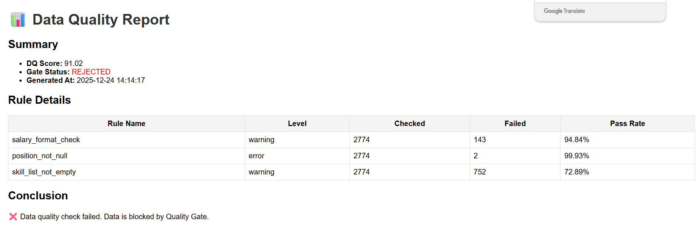

# 数据质量管理平台（Data Quality Center）

**Version：V1.0**

---

## 一、项目背景（Project Background）

在实际的数据平台建设中，ETL 作业的成功执行并不等同于数据的可信与可用。

随着数据来源逐渐多样化，上游数据质量往往难以完全受控，常见问题包括字段缺失、格式不一致、业务语义模糊以及异常值混入等。在许多场景下，这类问题并不会在 ETL 阶段直接暴露，而是在数据分析、报表或业务决策阶段才被发现。
此时不仅排查成本高，而且容易影响分析结论的可靠性，甚至导致错误决策。

然而,在实际工程中，数据质量管理通常存在以下不足：

- 数据质量校验零散分布在 ETL 脚本中，缺乏统一规范
- 缺少可配置、可复用的数据质量规则体系
- 数据质量结果无法量化评估，难以形成统一标准
- 缺乏数据质量拦截（Quality Gate）与审计追溯机制

为解决上述问题，本项目基于**数据治理（Data Governance）**思想，设计并实现了一个**独立于 ETL 的数据质量管理平台（Data Quality Center）**。

该平台通过**规则配置、质量评分与质量门禁机制**，在数据进入数据仓库之前进行统一、可审计的数据质量评估，从而提升整体数据可信度和可治理性。

---

## 二、项目目标（Project Objectives）

本项目旨在构建一套**可配置、可审计、可联动**的数据质量管理能力，具体目标包括：

### 1. 数据质量准入控制（Quality Gate）

为数据设置统一的数据质量门槛，只有通过数据质量校验的数据才允许进入数据仓库，从源头保障下游数据分析和业务决策的可靠性。

### 2. 数据质量量化评估与可视化

通过规则权重与质量评分模型，对数据质量进行量化评估，并自动生成数据质量报告，方便非技术人员直观了解数据质量状态。

### 3. 数据质量可分析、可审计、可追溯

对每次数据质量评估结果进行审计记录，支持数据质量趋势分析、问题复盘和历史追溯，提升数据治理的可持续性。

### 4. 异常数据快速感知与联动通知

当发现数据质量不合格或系统异常时，可联动通知机制（如邮件、即时通讯工具等），第一时间通知数据所有者，缩短问题响应和处理链路。

---

## 三、系统架构（System Architecture）

### 1. 总体架构说明

数据来源可以包括文件、数据库及 API 接口等多种形式。  
数据通过 ETL 流程完成抽取与基础转换后，进入数据质量管理中心进行统一的数据质量评估。

数据质量管理平台基于**可配置的规则引擎**，对数据进行：

- 质量校验
- 质量评分
- 质量门禁判定（Quality Gate）

质量达标的数据将被允许进入数据仓库，供后续分析与应用使用；未达标的数据将被拒绝入库，并通过通知机制告知数据所有者进行处理。

ETL 与数据质量管理平台相互独立，通过清晰的接口进行解耦设计，既保证数据加工的灵活性，又确保数据质量控制的统一性与可扩展性。

---

### 2. 模块划分

#### （1）规则引擎（Rule Engine）

- 使用 YAML 进行规则配置
- 支持配置内容：
  - 校验字段
  - 规则类型
  - 规则等级（`error` / `warning`）
  - 权重（用于计算 DQ Score）

#### （2）数据质量评估（DQ Evaluation）

- 执行数据质量规则
- 计算结果：
  - Rule Result
  - DQ Score
  - Quality Status（`PASSED` / `WARNING` / `REJECTED`）
- 触发 Quality Gate

#### （3）输出与治理（Output & Governance）

- 数据质量报告
- 数据质量审计日志
- 异常日志 / 告警
- 数据质量趋势分析

---

## 四、Data Quality 核心机制

### 1. DQ Score 机制

- 根据规则权重进行评分计算
- 不同级别规则拥有不同权重
- DQ Score 用于反映数据整体健康程度

### 2. Quality Gate 机制

| 情况 | 状态 | 行为 |
|----|----|----|
| Error 级规则失败 | ❌ REJECTED | 拦截 |
| Score 低于阈值 | ⚠ WARNING | 放行 |
| 全部通过 | ✅ PASSED | 放行 |

---

## 五、ETL 与数据质量的职责边界

### 1. ETL 的核心目标：让数据可被使用

ETL 主要承担以下职责：

- 从多源系统（文件 / 数据库 / API）抽取原始数据
- 数据结构化处理（字段拆分、类型转换、标准化）
- 修复明显的技术性问题：
  - 空值统一处理
  - 薪酬单位换算、区间转数值等
- 在不破坏原始语义的前提下，生成分析友好的字段

**重要原则：ETL 不做业务层面的数据质量裁决。**

---

### 2. 数据质量管理的目标：判断数据是否值得被信任

数据质量管理平台负责：

- 基于规则引擎进行质量校验：
  - 完整性（Completeness）
  - 有效性（Validity）
  - 一致性（Consistency）
- 区分不同质量等级（error / warning）
- 计算整体数据质量得分（DQ Score）
- 执行质量门禁（Quality Gate）
- 生成质量报告、审计日志与告警事件

**重要原则：DQ 不修改数据本身，只做评估与裁决。**

---

### 3. 原始字段与处理字段并存（字段语义演进）

为满足数据可追溯性与分析友好性，采用**字段语义演进（Semantic Evolution）**策略：  
同一业务字段，允许“原始字段 + 处理字段”并存，而不是覆盖原始值。

#### 示例：skills 字段

| 字段名 | 含义 |
|----|----|
| skills_raw | 原始采集字段，允许为空 |
| skills | ETL 处理后字段，空值统一为空列表 |

- ETL 生成 `skills`
- DQ 既可校验 `skills_raw`（来源质量）
- 也可校验 `skills`（可用性质量）

#### 示例：salary 字段

| 字段名 | 含义 |
|----|----|
| salary_raw | 原始薪酬描述 |
| salary_avg | ETL 计算后的平均薪酬 |

原始字段用于质量校验（格式、范围、合理性）  
派生字段用于分析计算  
数据质量规则不会因为 ETL 已经处理过而忽略原始字段  
当前版本重点校验原始薪酬字段的可解析性与可用性，薪酬数值合理性与分布异常规则作为后续演进方向

---

### 4. 质量门禁核心理念

- ETL 永远不阻断流程
- 是否允许进入数据仓库，由 DQ 平台统一裁决
- 裁决规则：
  - Error 失败 → REJECTED
  - Score 低于阈值 → WARNING
  - 达标 → PASSED

---

### 5. 设计价值总结

- 避免在 ETL 中硬编码质量规则
- 质量规则可配置、可审计、可演进
- 数据问题可追溯来源
- 为后续数据治理体系提供基础

---

## 六、数据质量报告与审计

### 1. HTML 数据质量报告

- 数据质量得分
- 数据质量状态
- 各规则校验结果

### 2. 数据质量审计

- 每次运行记录质量结果
- 支持质量趋势分析
- 支撑长期治理决策  
  

---

## 七、项目结构说明

| 目录/文件 | 说明 |
|-----------|------|
| **config/** | 全局配置文件（路径、规则、阈值等） |
| **data/** | 数据目录（示例数据 / 本地运行数据） |
| **data_sources/** | 数据源接入层 |
| **docs/** | 项目文档与说明材料 |
| **dq_engine/** | 数据质量引擎核心模块 |
| **logs/** | 运行日志（审计日志 / 质量日志 / 系统日志） |
| **notebooks/** | 数据分析与探索性分析 |
| **ops/** | 运维与运行脚本 |
| **reports/** | 数据质量报告输出 |
| **storage/** | 中间数据与持久化存储 |
| **utils/** | 通用工具函数 |
| **main.py** | 项目主入口（一键运行） |
| **README.md** | 项目说明文档 |
| **.gitignore** | Git 忽略规则文件 |

---

## 八、快速开始（Quick Start）

1. 准备示例数据（CSV 文件）  
  本项目默认提供示例数据用于快速体验：  
  data/sample/jobs_sample.csv  
  真实业务数据请放置在 `data/` 目录下，并在运行前在配置文件'setttings.py'中自行替换数据路径  
2. 配置 rules.yaml
3. 运行程序：main.py
4. 查看HTML报告  
   查看审计日志  
   查看Gate结果  

---
## 九、Roadmap
- 保留原始字段（skills_raw 等）
- 多数据源接入
- 数据仓库集成
- 警系统对接（钉钉 / 邮件）
- 规则版本管理

---
## 十、项目定位说明
本项目为数据质量管理与数据治理能力的示例性实现，重点在于架构设计、规则机制和治理流程，而非特定业务数据本身。